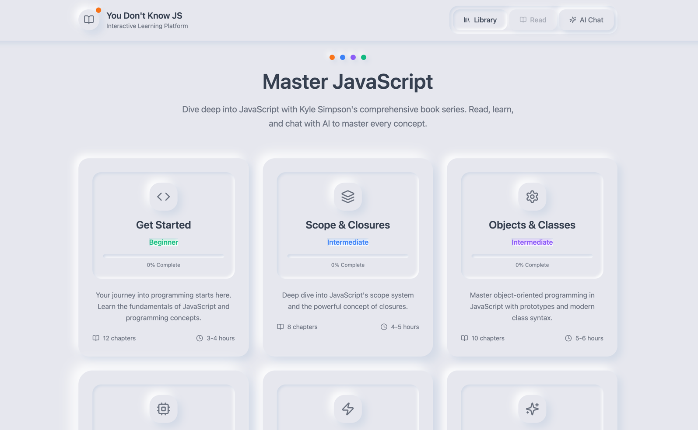
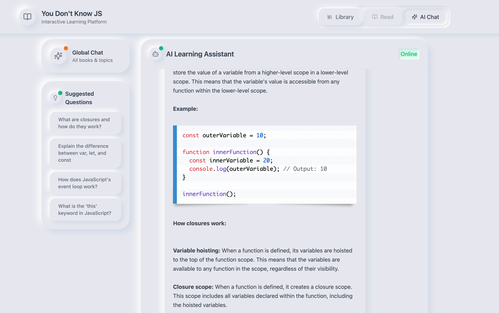
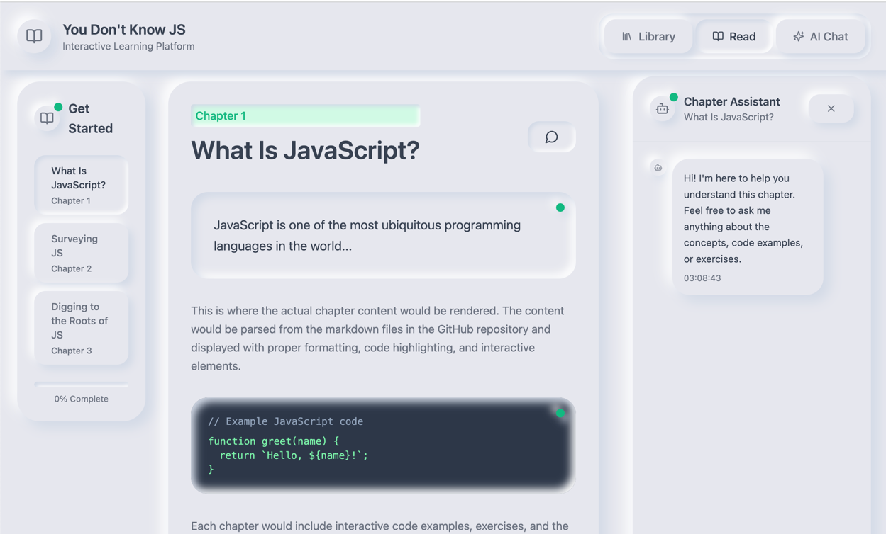

# 🧠 YDKJS Reader - RAG-Powered AI Reading Assistant

A fullstack GenAI demo that lets you read and query the classic *You Don't Know JS* books with AI-assisted answers all powered by **Retrieval-Augmented Generation (RAG)**, **local LLMs**, and **vector search**.

Built as a learning project but designed like a real-world GenAI system.

---

## 🚀 Why I Built This

With all the buzz around large language models, I wanted to move past the hype and *actually build something*. This project is my deep dive into:

- **RAG (Retrieval-Augmented Generation):** How to reduce hallucinations and bring in accurate, up-to-date context from [external sources](https://github.com/getify/You-Dont-Know-JS/tree/2nd-ed/get-started).
- **Running local models:** Using [Ollama](https://ollama.com/) to avoid cloud lock-in and experiment with private deployments (Gemma 4B and nomic-embed-text).
- **ChromaDB + embeddings:** Building a vector store and understanding how chunking, retrieval, and semantic search actually work.
- **Fine-tuning exploration (coming next):** Planning to integrate lightweight fine-tuning (LoRA/PEFT) for tone alignment or domain adaptation.

All of this is wrapped in a **Dockerized stack** with a Next.js frontend and FastAPI backend making it easy to run locally or deploy.

---

## 🧱 Tech Stack Overview

| Layer        | Tech                     | Purpose                                                  |
| ------------ | ------------------------ | -------------------------------------------------------- |
| Frontend     | Next.js + Tailwind       | UI for reading + asking questions                       |
| Backend      | FastAPI                  | REST API for inference, retrieval, and caching          |
| LLM Runtime  | Ollama                   | Local model host for LLMs and embeddings                |
| Vector Store | ChromaDB                 | Stores embedded book content for semantic search        |
| Cache/DB     | SQLite                   | Lightweight caching of fetched book data                |
| Deployment   | Docker + Docker Compose  | Clean, reproducible local dev and containerized build   |

---

*Project Setup will be updated soon with detailed instructions on how to run this locally.*





[//]: # (## Docker Setup)

[//]: # ()
[//]: # (This application has been dockerized to make deployment easier. The setup includes:)

[//]: # ()
[//]: # (- Python FastAPI backend)

[//]: # (- NextJS frontend)

[//]: # (- Ollama for LLM capabilities)

[//]: # (- ChromaDB for vector storage)

[//]: # (- SQLite for caching responses from the github repo)

[//]: # ()
[//]: # (### Prerequisites)

[//]: # ()
[//]: # (- Docker and Docker Compose installed on your system)

[//]: # (- At least 8GB of RAM available for Docker &#40;Ollama models require significant memory&#41;)

[//]: # ()
[//]: # (### Getting Started)

[//]: # ()
[//]: # (Here's how to get everything up and running:)

[//]: # ()
[//]: # (1. **Clone the repo**:)

[//]: # (   ```bash)

[//]: # (   git clone <repository-url>)

[//]: # (   cd ydkjs-reader)

[//]: # (   ```)

[//]: # ()
[//]: # (2. **Start the app with Docker** &#40;this spins up the fullstack + local model pipeline&#41;:)

[//]: # (   ```bash)

[//]: # (   docker-compose up -d)

[//]: # (   ```)

[//]: # ()
[//]: # (   On the first run, this will:)

[//]: # (   - Install dependencies)

[//]: # (   - Build the Next.js frontend and FastAPI backend)

[//]: # (   - Download Ollama models &#40;`gemma:4b`, `nomic-embed-text`&#41;)

[//]: # ()
[//]: # (3. **Access the app**:)

[//]: # (   - Frontend: [http://localhost:3000]&#40;http://localhost:3000&#41;)

[//]: # (   - Backend API: [http://localhost:8000]&#40;http://localhost:8000&#41;)

[//]: # ()
[//]: # (4. **&#40;Optional&#41; Stop the app**:)

[//]: # (   ```bash)

[//]: # (   docker-compose down)

[//]: # (   ```)

[//]: # ()
[//]: # (5. **&#40;Optional&#41; Rebuild after code changes**:)

[//]: # (   ```bash)

[//]: # (   docker-compose up -d --build)

[//]: # (   ```)

[//]: # ()
[//]: # (### Persistent Data)

[//]: # ()
[//]: # (The Docker setup includes volume mounts to ensure data persistence:)

[//]: # ()
[//]: # (- Ollama models are stored in a Docker volume)

[//]: # (- ChromaDB data is stored in `./server/chroma_db`)

[//]: # (- SQLite database is stored in `./server/app.db`)

[//]: # ()
[//]: # (### Stopping the Application)

[//]: # ()
[//]: # (```bash)

[//]: # (docker-compose down)

[//]: # (```)

[//]: # ()
[//]: # (### Rebuilding After Changes)

[//]: # ()
[//]: # (If you make changes to the code, rebuild the Docker image:)

[//]: # ()
[//]: # (```bash)

[//]: # (docker-compose up -d --build)

[//]: # (```)

[//]: # ()
[//]: # (### Resource Requirements)

[//]: # ()
[//]: # (Ollama requires significant resources, especially for running LLM models. The docker-compose.yml file includes resource limits, but you may need to adjust these based on your system capabilities.)

[//]: # ()
[//]: # (## Development)

[//]: # ()
[//]: # (For development purposes, you might want to run the components separately:)

[//]: # ()
[//]: # (### Backend &#40;Server&#41;)

[//]: # ()
[//]: # (```bash)

[//]: # (cd server)

[//]: # (pip install -r requirements.txt  # Create this file if it doesn't exist)

[//]: # (python entry.py)

[//]: # (```)

[//]: # ()
[//]: # (### Frontend &#40;Client&#41;)

[//]: # ()
[//]: # (```bash)

[//]: # (cd client)

[//]: # (npm install)

[//]: # (npm run dev)

[//]: # (```)

[//]: # ()
[//]: # (### Ollama)

[//]: # ()
[//]: # (Follow the installation instructions at [Ollama's website]&#40;https://ollama.com/download&#41; to install and run Ollama locally.)

[//]: # ()


### 🙏 Credits

This project uses content from the public [You Don't Know JS (2nd Edition)](https://github.com/getify/You-Dont-Know-JS) repository by [@getify](https://github.com/getify), used as the knowledge base for RAG in this demo.  
Content is licensed under the [Creative Commons Attribution-NonCommercial-NoDerivatives 4.0 International License](https://creativecommons.org/licenses/by-nc-nd/4.0/).